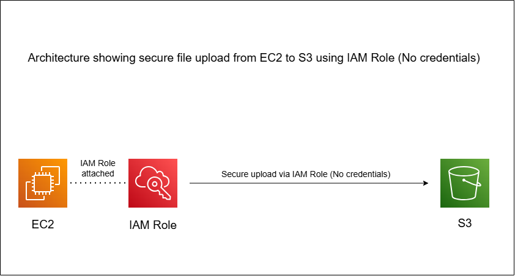
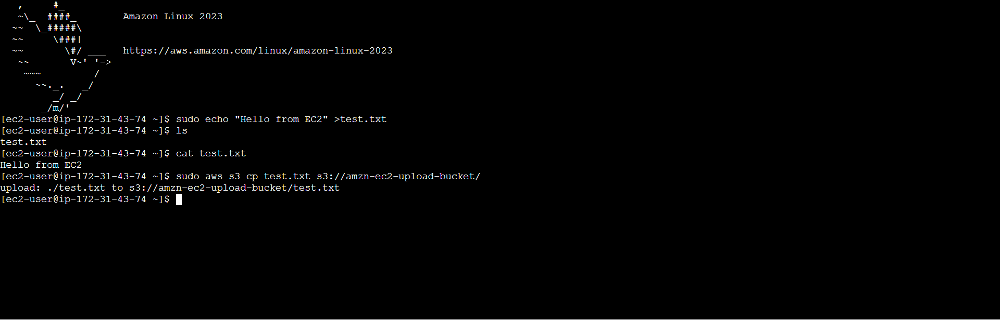
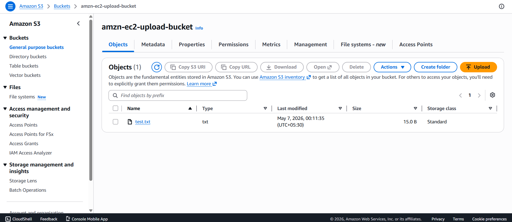
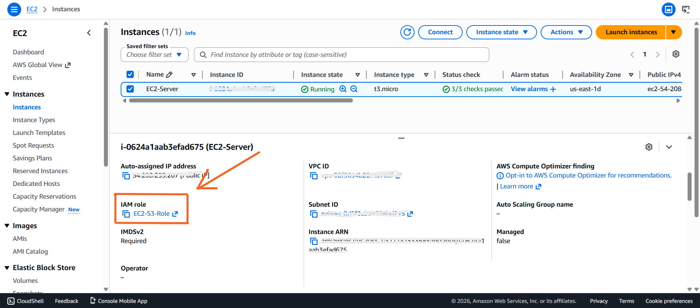

# 🔐 Secure EC2 to S3 File Upload using IAM Role

## 📌 Overview

This project demonstrates a secure method for enabling an EC2 instance to upload files to an S3 bucket using IAM Roles, without storing any access keys or credentials.

The solution follows AWS security best practices by using temporary credentials and applying the principle of least privilege.

---

## 🏗️ Architecture Diagram

---

## 🛠️ AWS Services Used

- AWS EC2
- AWS S3
- AWS IAM (Roles & Policies)
- AWS CLI

---

## 🧠 How It Works

1. An IAM Role is created with the required S3 permissions.
2. The role is attached to an EC2 instance.
3. EC2 automatically receives temporary credentials from AWS.
4. A file is created inside the EC2 instance.
5. AWS CLI is used to upload the file to the S3 bucket.
6. The file is securely stored in the S3 bucket.

---

## ⚙️ Implementation Steps

1. Created an S3 bucket.
2. Created an IAM Policy with the required S3 permissions.
3. Created an IAM Role and attached the policy.
4. Attached the IAM Role to the EC2 instance.
5. Connected to the EC2 instance using SSH.
6. Created a test file.
7. Uploaded the file to the S3 bucket using AWS CLI.
8. Verified that the file was uploaded successfully.

---

## 📸 Screenshots

### Upload from EC2

### File in S3 Bucket

### IAM Role Attached

---

## 🔐 Security Best Practices

- No access keys or passwords stored on the EC2 instance.
- IAM Role used instead of IAM User credentials.
- Temporary credentials automatically managed by AWS.
- Only the required permissions are granted (least privilege).

---

## 💼 Real-World Use Case

This architecture is commonly used in production environments where applications running on EC2 need to upload logs, backups, reports, images, or other files to S3 without exposing AWS credentials.

---
